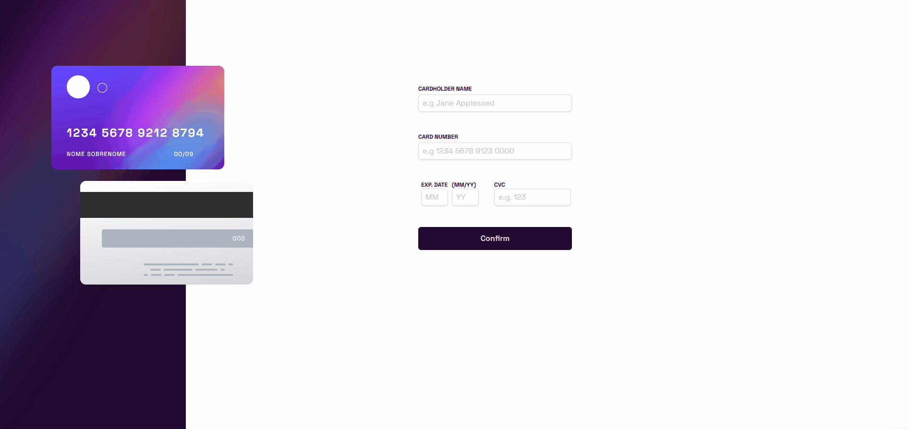
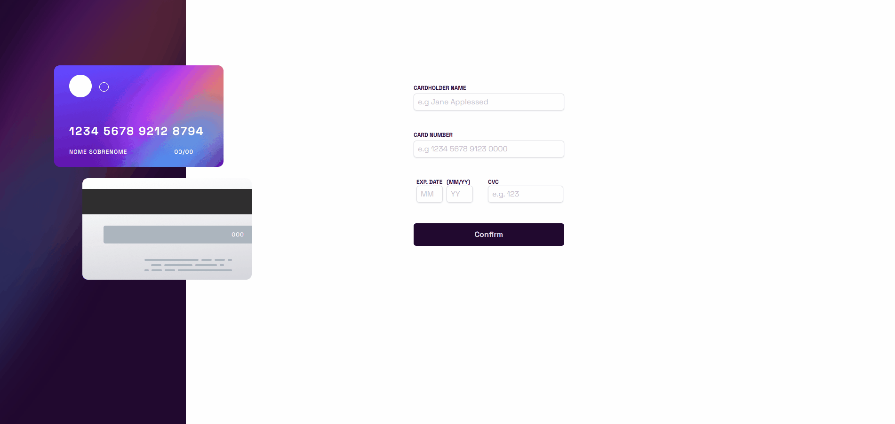
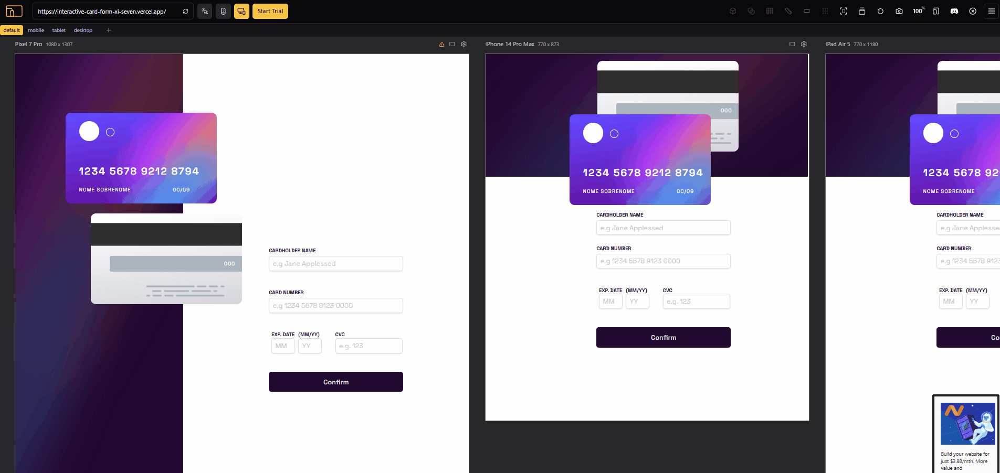

# 💳 Formulário de Cartão de Crédito

Projeto de um formulário interativo e validado para entrada de dados de cartão de crédito. Desenvolvido com React, React Hook Form, TypeScript e TailWindCSS. O projeto simula uma experiência real de preenchimento de dados de pagamento, com validações em tempo real e o usuário é redirecionado para um tela de confirmação.

## 📌 Funcionalidades

- ✅ **Validação de Formulário:** Uso do `react-hook-form` para validações como campos obrigatórios, formatos válidos e limites de caracteres.
- ✅ **Cartão Interativo:** Os dados digitados são refletidos em tempo real em um cartão visual estilizado.
- ✅ **Tela de Confirmação:** Após envio válido, aparece uma tela de agradecimento com opção de reiniciar o formulário.
- ✅ **Responsividade:** Layout adaptável para diferentes tamanhos de tela.

## 🚀 Tecnologias Utilizadas

- **React**
- **React Hook Form**
- **TailwindCSS**
- **JavaScript**
- **TypeScript**
- **HTML/JSX**

## 📁 Estrutura de Arquivos

```
📁 /public
┣ 📁 /images
📁 /src
┣ 📁 /components
┃ ┣ 📄 Button.tsx
┃ ┣ 📄 Card.tsx
┃ ┣ 📄 CompletionScreen.tsx
┃ ┣ 📄 Form.tsx
┃ ┣ 📄 MainPage.tsx
┣ 📁 /types
┃ ┣ 📄 Button.ts
┃ ┣ 📄 FormData.ts
┣ 📄 App.tsx
┣ 📄 main.tsx
```

## 🖥️ Demonstração

Link Deploy: https://interactive-card-form-xi-seven.vercel.app/




